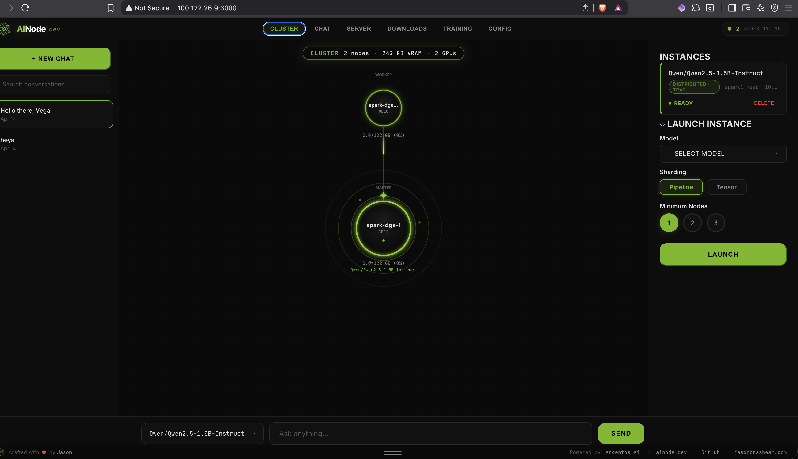
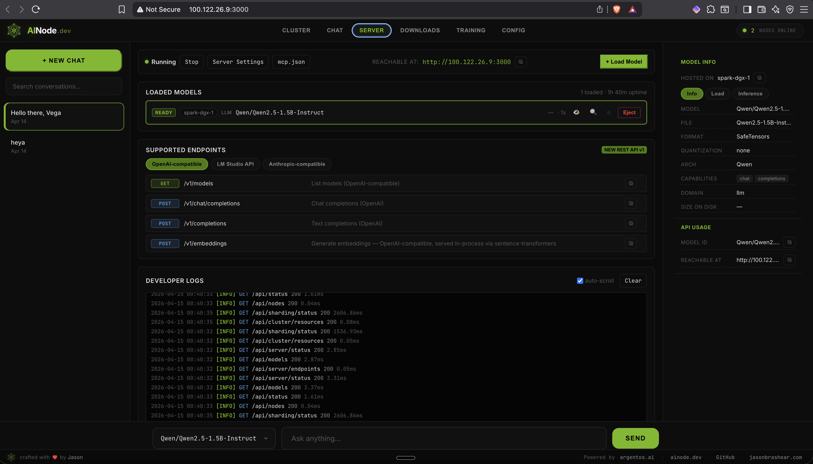
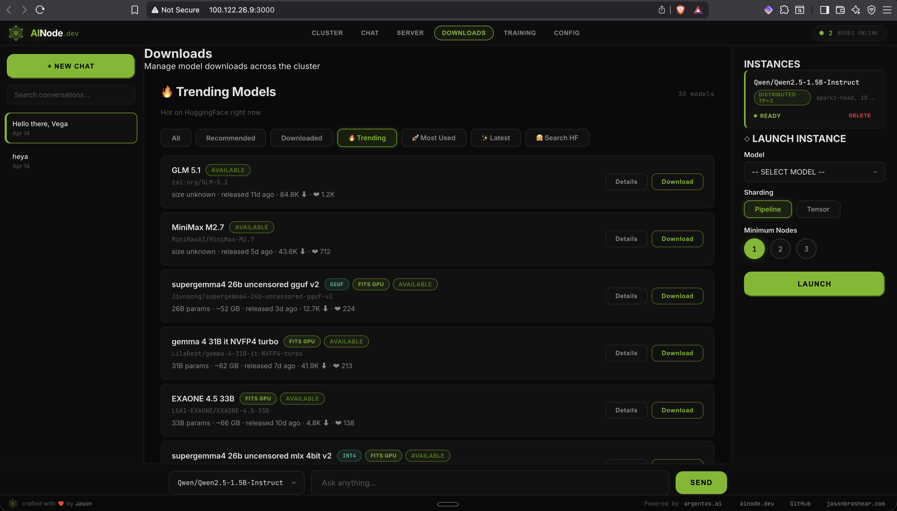
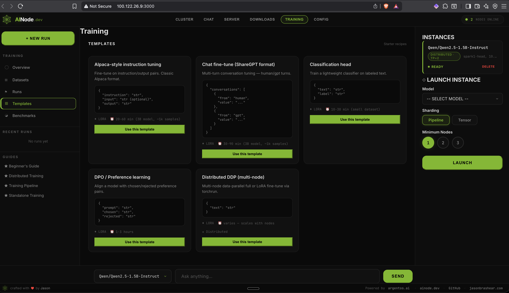
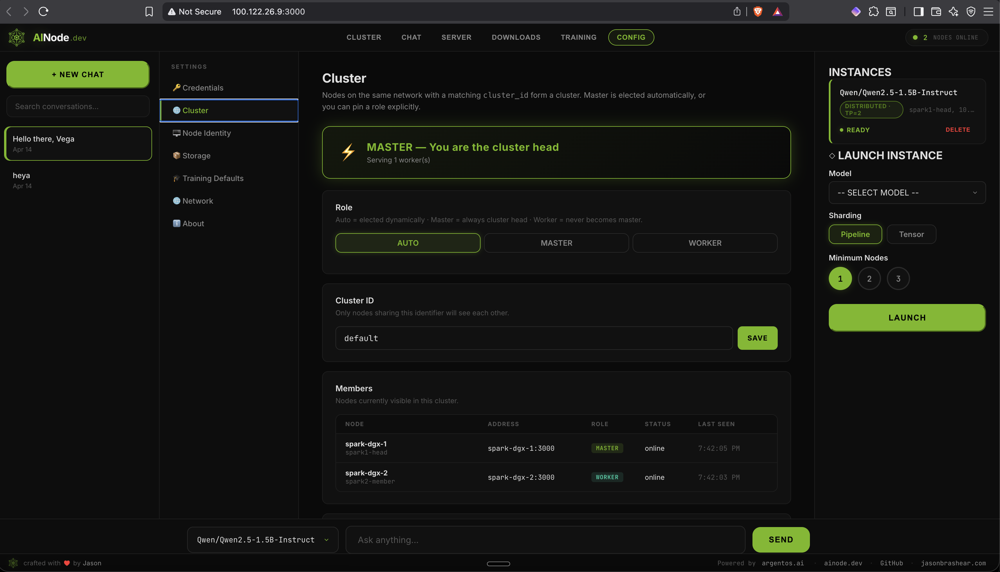

<!--
AINode — local AI platform for NVIDIA GB10 and any NVIDIA GPU server.
Keywords: NVIDIA DGX Spark, ASUS GX10, vLLM, Ray, tensor parallel,
OpenAI-compatible API, local LLM, self-hosted AI, LoRA fine-tuning,
cluster inference, GB10, CUDA 13, NCCL, RoCE, RDMA, container AI
platform, open source ChatGPT alternative.
-->

<p align="center">
  
</p>

<h1 align="center">AINode</h1>

<p align="center">
  <strong>Turn any NVIDIA GPU into a local AI platform.</strong><br/>
  <em>Inference + fine-tuning in your browser. One container to install. Add nodes, they find each other.</em>
</p>

<p align="center">
  <a href="https://github.com/getainode/ainode/releases/latest"></a>
  <a href="https://github.com/getainode/ainode/blob/main/LICENSE"></a>
  
  <a href="https://hub.docker.com/r/argentaios/ainode"></a>
  <a href="https://github.com/orgs/getainode/packages/container/package/ainode"></a>
  
  
  
  <a href="https://github.com/getainode/ainode/stargazers"></a>
  <a href="https://releasebot.io/updates/getainode/ainode"></a>
</p>

<p align="center">
  <a href="https://ainode.dev">ainode.dev</a>
  &nbsp;·&nbsp;
  <a href="https://docs.argentos.ai">docs</a>
  &nbsp;·&nbsp;
  <a href="#getting-started--step-by-step">Getting Started</a>
  &nbsp;·&nbsp;
  <a href="#screenshots">Screenshots</a>
  &nbsp;·&nbsp;
  <a href="#state-of-distributed-inference-april-2026">What Works / What Doesn't</a>
</p>

---

## What AINode is

AINode is a self-hosted AI appliance for **NVIDIA GB10** (DGX Spark, ASUS
GX10) and any NVIDIA GPU box. It ships as **one container** that bundles:

- A modern web UI (chat, cluster topology, server console, downloads, training)
- An OpenAI-compatible API (`/v1/chat/completions`, `/v1/completions`, `/v1/embeddings`)
- A GB10-patched vLLM with Ray for cross-node tensor/pipeline parallel
- UDP node discovery for automatic clustering
- NFS-shared model storage so you download once and use everywhere
- Scripted fine-tuning (LoRA, QLoRA, full FT, DPO, distributed DDP)

One `docker pull`, one systemd unit per box, done. No host Python venv,
no source-built vLLM, no fragile runtime wiring.

```bash
curl -fsSL https://ainode.dev/install | bash
```

---

## Screenshots

### Cluster view — 2 nodes, 244 GB aggregated VRAM, distributed inference



The "MASTER" node (head) runs the API and orchestrates. The smaller
orbiting node (member) has its GPU reserved for a Ray worker that the
head placed. The instance card shows **DISTRIBUTED · TP=2** — the model
is sharded across both GPUs.

### Chat


Full-featured chat with streaming tokens, prompt history, code
highlighting, per-message metrics (TTFT, tokens/sec, total tokens).
Works against whatever model the cluster has loaded — solo or sharded.

### Server — API console (LM Studio style)



Live developer console: which models are loaded on which node,
OpenAI-/LM-Studio-/Anthropic-compatible endpoints, per-request logs
with status codes and latency, eject-model buttons, copyable cURL
snippets.

### Downloads — live HF catalog



Browse trending HuggingFace models, with **AVAILABLE** / **FITS GPU**
badges computed from your cluster's aggregate VRAM. Queue downloads to
the shared NFS cache; any node can load them instantly.

### Training — overview


Three quick-start paths: **LoRA** (lightweight, most users), **Distributed
DDP** (multi-node fine-tuning), **Full fine-tune** (single large-memory
node). Track active + completed runs, GPU-hours, and jump into dataset
management.

### Training — templates



Starter recipes for instruction tuning (Alpaca), chat fine-tuning
(ShareGPT), classification heads, DPO / preference learning, and
multi-node DDP. Each template ships a working dataset schema so you
can start training in minutes.

### Config — cluster



Pin the node's role (`auto` / `master` / `worker`), set a shared
`cluster_id` so only matching nodes see each other, and inspect the
current member list with per-node role, address, and last-seen.

---

## Getting Started — step by step

### Single node (solo mode)

1. **Install Docker** + NVIDIA container toolkit on your Linux box.
2. **Pull the image** and wire up the systemd unit:
   ```bash
   curl -fsSL https://ainode.dev/install | bash
   ```
   That one-liner performs:
   ```
   docker pull ghcr.io/getainode/ainode:0.4.0
   systemctl enable --now ainode.service
   ```
3. **Open the UI** at `http://<your-ip>:3000`. First-run onboarding walks
   you through picking a model. Click a model card → click **Launch** →
   chat.

Upgrade is `ainode update` (pulls the latest image and restarts).

**Prefer to pull the image yourself?** Both registries serve identical
images — GHCR is canonical (what the installer uses), Docker Hub is a
public mirror:

```bash
docker pull ghcr.io/getainode/ainode:0.4.0      # canonical
docker pull argentaios/ainode:0.4.0              # Docker Hub mirror
```

### Two nodes (distributed mode)

For models that don't fit on one GPU — e.g. a 70B-class model sharded
across two DGX Sparks:

1. **Wire a clean high-speed link** between the two nodes (direct QSFP
   cable on its own `/24`, or a dedicated switch port). See
   [Networking requirements](#networking-requirements) — this matters.
2. **Install AINode on both** (step 1 above).
3. **On the peer**, set member mode in `~/.ainode/config.json`:
   ```json
   {
     "distributed_mode": "member",
     "cluster_interface": "enp1s0f0np0",
     "ssh_user": "sem"
   }
   ```
   `sudo systemctl restart ainode`.
4. **On the head**, set head mode and add passwordless SSH to the peer:
   ```json
   {
     "distributed_mode": "head",
     "peer_ips": ["10.0.0.2"],
     "cluster_interface": "enp1s0f0np0",
     "ssh_user": "sem"
   }
   ```
   ```bash
   ssh-copy-id sem@10.0.0-2 && sudo systemctl restart ainode
   ```
5. **Open the head UI** — you should see both nodes, aggregated VRAM
   ("2 nodes · 244 GB · 2 GPUs"), and the instance badged as
   **DISTRIBUTED · TP=2**.

Want to do it from the browser instead? Open the Launch Instance
panel, pick the model, set **Minimum Nodes=2**, click **Tensor** →
**LAUNCH**. The UI writes the config and hot-swaps the engine for you.

---

## Features

| Feature | Status |
|---|---|
| One-command install | ✅ |
| Unified container image (UI + engine) | ✅ v0.4.0 |
| Auto-detect GPU and memory | ✅ |
| Chat UI in your browser | ✅ |
| OpenAI-compatible API | ✅ |
| Embeddings endpoint (`/v1/embeddings`) | ✅ |
| Live HF model catalog with trending + download manager | ✅ |
| NFS-shared model storage across cluster | ✅ |
| Multi-node auto-discovery (UDP broadcast) | ✅ |
| Distributed tensor-parallel inference across nodes | ✅ (4-node verified — 487 GB aggregated VRAM) |
| Cluster topology UI (members, VRAM aggregate, instance badges) | ✅ |
| Browser-based fine-tuning (LoRA / QLoRA / Full + DDP) | ✅ |
| Training artifact retrieval + download via API | ✅ |
| LoRA adapter merge into base model | ✅ |
| Checkpoint resume | ✅ |
| Evaluation loop (configurable train/eval split) | ✅ |
| W&B logging integration | ✅ |
| Custom training template persistence | ✅ |
| Prometheus metrics endpoint (`/metrics`) | ✅ |
| `ainode role master\|worker\|solo` CLI | ✅ |
| Worker nodes start instantly — no model required | ✅ |
| Web portal available immediately on start | ✅ |
| Cluster-wide update from master UI (`⬆ Update all` button) | ✅ |
| Topology loading animation + per-node fade-in | ✅ |
| AWQ models on GB10 (sm_12.1) — `awq_marlin` kernel fix | ✅ |

---

## Relation to the Community

AINode builds on excellent open-source work in the DGX Spark ecosystem.
In particular, our base image inherits the patched NCCL from
**[eugr/spark-vllm-docker](https://github.com/eugr/spark-vllm-docker)**
(`dgxspark-3node-ring` branch), which we've found to be the most reliable
variant for handling GB10 unified-memory topologies and fabric setups.

eugr's project remains the go-to for raw, high-performance vLLM clustering
on Spark hardware. AINode layers a modern browser UI, one-command
deployment, in-browser chat + OpenAI API, and distributed fine-tuning on
top of that strong foundation.

Huge thanks to eugr and the contributors making multi-node Spark setups
practical.

---

## State of Distributed Inference (April 2026)

We owe readers the honest picture, not a checkmark-soup. Here's what's
really running on our hardware.

### What works today (verified)

- **Single-node inference** on any NVIDIA GB10 box (DGX Spark, ASUS GX10).
- **Two-node tensor-parallel** (TP=2) with one GPU per node on a
  direct-connect QSFP `/24`. Both GPUs show ~61 GB of
  `ray::RayWorkerWrapper` memory; NCCL chose `NET/IB RoCE @ 200 Gb/s`.
- **Four-node cluster** (3× DGX Spark + 1× ASUS GX10) — 487 GB
  aggregated VRAM, all four discovered automatically via UDP, topology
  visible in the browser UI. Verified April 2026.
- **One-container-per-node install** — `curl -fsSL https://ainode.dev/install | bash -s -- --job worker`
  installs in seconds with no model required.
- **`ainode role`** CLI sets master/worker/solo instantly.
- **Worker nodes start immediately** — no model download, no engine
  warmup. Web portal is up within seconds of `systemctl start ainode`.
- **Shared model storage over NFS** from an NVMe-oF-backed master.
- **UDP cluster discovery** on port 5679 with real peer-IP capture.
- **Inference throughput:** ~35 tok/s for a warmed-up model over
  the RoCE fabric.

### What doesn't work yet

- **TP=4 distributed inference** across all four nodes — cluster forms
  correctly, distributed launch under test.
- **Ray over Tailscale** — use physical cables or a dedicated switch.

### Lessons learned the hard way

0. **Role clarity eliminates half the problems.** The single biggest
   UX improvement was `ainode role master|worker|solo`. Workers don't
   need a model, don't need to think, don't need config editing. They
   start in 3 seconds and announce themselves. The master is the only
   node that needs a model. Everything else follows from that.

1. **Single NIC per cluster subnet.** Multi-NIC ambiguity breaks NCCL
   ring setup silently; `NCCL_SOCKET_IFNAME` only tells NCCL which
   address to *listen* on, not which source the kernel picks for
   outbound traffic.
2. **Ray placement groups outlive SIGKILL.** Hung vLLM doesn't release
   the reservation; Ray's GCS still thinks the GPU is busy. Always
   `docker rm -f` the full chain before retrying.
3. **Block-level shared storage is unsafe for multi-writer.** NVMe-oF +
   ext4 mounted on two hosts corrupts under concurrent writes. Put NFS
   on top of a single-host mount.
4. **The patched NCCL in `eugr/spark-vllm-docker`** (`dgxspark-3node-ring`
   branch) is the only variant we've seen reliably handle GB10
   unified-memory topologies. Our base image inherits it.
5. **SSH from a root container into a host user** fails silently when
   keys are mounted read-only from the host. Our entrypoint copies
   `/host-ssh` → `/root/.ssh` with correct perms and injects
   `User <ssh_user>` for peer IPs.

### Why 3 nodes is harder than 2 (and why 4 is probably easier)

**Two nodes**: a single direct-connect cable on one `/24`. One cable,
one subnet, one candidate interface per host. NCCL can't get confused.
TP=2 splits the weights evenly. Solved problem.

**Three nodes**: no simple physical topology. Options:

- **Triangle mesh** (A↔B, B↔C, A↔C) with each link on its own `/30` —
  community tooling assumes this, nobody autoconfigures it.
- **Dedicated cluster switch** with one NIC per node on an isolated
  subnet — easier, but a hardware purchase.
- **Star topology** — asymmetric latency, not recommended.

If your three nodes just share a regular LAN, you hit multi-NIC routing
ambiguity (lesson #1). We did. NCCL ring setup succeeded; data never
flowed.

**Four nodes**: paradoxically simpler once you commit to a switch,
which is the only practical option for 4+. One NIC per node on a fresh
`/24`, TP=4 lines up with vLLM's defaults, and the community has
published recipes (eugr's `recipes/4x-spark-cluster/`, NVIDIA's internal
4× Spark reference setups).

**Our hypothesis:** the difficulty is not *N* nodes — it's *how you
wire N nodes*. Two is forced (one cable). Three forces a topology
decision. Four+ forces a switch, which is what the community tools
expect. Stick to 2 now; buy the switch; jump straight to 4.

---

## Networking requirements

AINode relies on NCCL for cross-node tensor-parallel, and NCCL works
best when it owns a clean link.

- **Passwordless SSH** from the head's host user to every peer.
- **Single active NIC per cluster subnet** on every node. Multiple
  interfaces on the same `/24` breaks the NCCL ring.
- **No VPN between nodes for cluster traffic.** Tailscale is fine for
  laptop→cluster SSH; not fine as the NCCL transport.
- **Consistent MTU** across the cluster subnet.

### Recommended topologies

| Cluster size | Topology | Notes |
|---|---|---|
| 2 nodes | Direct QSFP cable, each end on its own IP in a fresh `/24` | Simplest, verified |
| 3 nodes | Triangle direct-connect (3 cables, each on a `/30`) **or** dedicated switch | Mesh is finicky; switch is easier |
| 4+ nodes | Dedicated QSFP switch on its own `/24`, one NIC per node | The only practical option |

### Diagnostic commands

```bash
# Confirm RDMA is live on your ConnectX-7
ibstat mlx5_0 | grep -E "State|Rate"         # expect "Active" + "Rate: 200"

# Confirm exactly one interface has an IP on the cluster subnet
ip -br -4 addr | grep 10.0.0                 # expect one line per node

# Confirm cross-node reach on the cluster subnet (not Tailscale)
ping -c 2 10.0.0.2
traceroute 10.0.0.2                          # 1 hop = right link

# Passwordless SSH works
ssh sem@10.0.0.2 true && echo OK

# After launching distributed: confirm NCCL uses RoCE, not Socket
docker exec vllm_node bash -c 'grep -E "Using network|NET/IB.*RoCE" \
  /tmp/ray/session_latest/logs/worker-*-01000000-*.out | head -5'
# Expect: "Using network IB" + "NET/IB ... mlx5_0:1/RoCE ... speed=200000"
```

### Optional: GPU Direct RDMA (GDR)

Without GDR, traffic goes GPU → CPU → NIC → NIC → CPU → GPU. With GDR
it bypasses the CPU hop. On GB10 the unified-memory CPU hop is cheap,
so the win is smaller than on discrete GPUs but still measurable.

```bash
# Load the peermem module on each host (not the container)
sudo modprobe nvidia_peermem
echo nvidia_peermem | sudo tee -a /etc/modules-load.d/nvidia-peermem.conf

# Verify NCCL picks it up next launch
docker exec vllm_node bash -c 'grep "GPU Direct RDMA" \
  /tmp/ray/session_latest/logs/worker-*-01000000-*.out'
# Expect: "GPU Direct RDMA Enabled"
```

---

## Shared model storage across a cluster

Downloading a 70 GB model three times on a three-node cluster is
wasteful. AINode supports a shared `models_dir` so every node pulls
from the same cache.

Block-level shared storage (NVMe-oF, iSCSI, Fibre Channel) is fast but
**unsafe for multiple Linux kernels writing simultaneously** — ext4
/ XFS have no distributed lock manager. Layer NFS on top:

```
  Storage array (NVMe-oF, SAN, local NVMe)
         │
         ▼
  MASTER NODE  ← ext4/XFS mounted here, owns the disk
    │   │
    │   └── NFS server exports /mnt/ai-models
    ▼
  WORKERS      ← mount the NFS share at /mnt/ai-shared
```

NFS over a 100G fabric gives 3–8 GB/s — vLLM model loading is a
one-shot sequential read, so you won't notice. For 100 GB+ models
where load time hurts, add an rsync-to-local staging step.

---

## CLI reference

The installer puts a thin `ainode` wrapper at `/usr/local/bin/ainode`.
Host-side commands (`update`) run directly; everything else is forwarded
into the running container via `docker exec`. You never need to type
`docker` yourself.

```bash
ainode update                # docker pull + restart service (upgrade in place)
ainode start                 # Start AINode (inference + web UI)
ainode stop                  # Stop AINode
ainode status                # Show cluster status
ainode models                # List available models
ainode service install       # Install the systemd unit
ainode service status        # Show systemd state + recent journal
ainode config                # Show current configuration
ainode logs -f               # Tail the engine log
```

### Updating AINode

New releases ship as a new container image tag. To upgrade in place:

```bash
ainode update
```

That runs `docker pull ghcr.io/getainode/ainode:latest` and restarts
the systemd service. Your config (`~/.ainode/config.json`), models
(`~/.ainode/models/`), and fine-tune outputs are on the host — the
container is stateless, so upgrades never touch your data.

To pin a specific version instead of `:latest`:

```bash
AINODE_IMAGE=ghcr.io/getainode/ainode:0.4.1 ainode update
```

---

## API

AINode exposes an OpenAI-compatible API. Drop it into any tool that
speaks OpenAI:

```python
from openai import OpenAI

client = OpenAI(
    base_url="http://localhost:8000/v1",
    api_key="not-needed",
)

resp = client.chat.completions.create(
    model="Qwen/Qwen2.5-1.5B-Instruct",
    messages=[{"role": "user", "content": "Hello!"}],
)
print(resp.choices[0].message.content)
```

Works with Open WebUI, LiteLLM, LangChain, llama.cpp clients, and
anything else that speaks OpenAI.

### Metrics — `/metrics` (Prometheus) and `/api/metrics` (JSON)

AINode exposes its own metrics on the same port as the API:

```bash
curl http://localhost:8000/metrics           # Prometheus text exposition
curl http://localhost:8000/api/metrics       # JSON snapshot
curl http://localhost:8000/api/metrics/gpu   # GPU subset
```

Key series:

- `ainode_uptime_seconds`, `ainode_build_info{version=...}`
- `ainode_requests_total`, `ainode_request_errors_total`
- `ainode_tokens_generated_total`, `ainode_tokens_per_second`
- `ainode_request_latency_milliseconds{quantile="0.5|0.95|0.99"}`
- `ainode_requests_by_model_total{model=...}`
- `ainode_gpu_utilization_percent`, `ainode_gpu_memory_used_bytes`, `ainode_gpu_temperature_celsius`

Scrape config for Prometheus:

```yaml
scrape_configs:
  - job_name: ainode
    static_configs:
      - targets: ["ainode-host:8000"]
```

---

## Requirements

- **OS**: Ubuntu 22.04+ (DGX Spark OS works out of the box)
- **GPU**: NVIDIA GB10 (DGX Spark, ASUS GX10) — or any NVIDIA GPU with
  CUDA 13 drivers
- **Memory**: 8 GB+ GPU for small models, 128 GB recommended for the
  big ones, 240 GB+ aggregated for real sharded work
- **Disk**: 20 GB for the container image; more for models
- **Docker**: 24.0+ with the NVIDIA Container Toolkit

---

## Why AINode?

| | Cloud AI | AINode |
|---|---|---|
| Monthly cost | $100–10,000+ | $0 (you own the hardware) |
| Data privacy | Your data on their servers | Your data stays local |
| Rate limits | Yes | None |
| Latency | 200–2000 ms | 10–50 ms |
| Fine-tuning | Limited, expensive | Unlimited, free |
| Internet required | Yes | No |
| Models available | Their choice | Your choice |

---

## Roadmap

- [x] Core CLI + installer
- [x] vLLM integration (patched NCCL for GB10)
- [x] Web UI (chat, server, downloads, training, config)
- [x] Multi-node auto-discovery + cluster topology view
- [x] Automatic model sharding across nodes (TP=2 verified)
- [x] NFS-shared model storage
- [x] Unified container image + systemd install
- [x] Browser-driven fine-tuning (LoRA / QLoRA / Full + DDP)
- [x] Training artifact retrieval, LoRA merge, checkpoint resume
- [x] Evaluation loop + W&B integration
- [x] Prometheus metrics endpoint (`/metrics`)
- [ ] 4-node TP=4 sharded inference (cluster hardware ready, launch under test)
- [ ] Model marketplace (quantized variants, custom registries)
- [ ] Mobile-friendly UI

---

## Contributing

AINode is Apache-2.0 and welcomes contributions. See
[CONTRIBUTING.md](CONTRIBUTING.md) — and please run the test suite
(`pytest tests/`) before opening a PR.

---

## License

Apache 2.0 — use it however you want.

---

<p align="center">
  <sub>crafted with <span style="color:#e74c3c">♥</span> by Jason Brashear · powered by <a href="https://argentos.ai">argentos.ai</a></sub>
</p>
