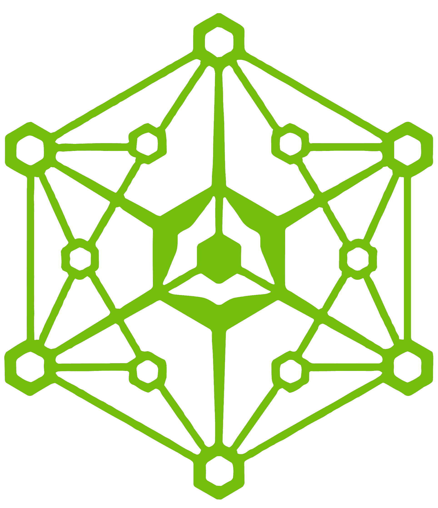
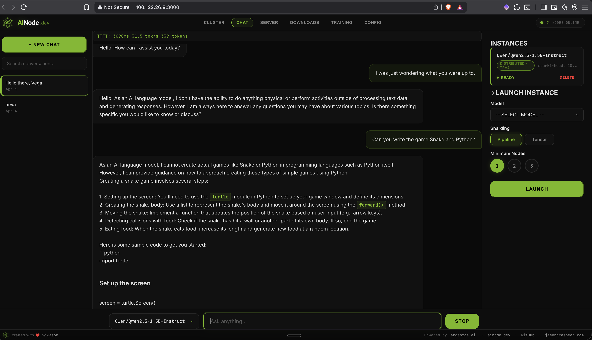
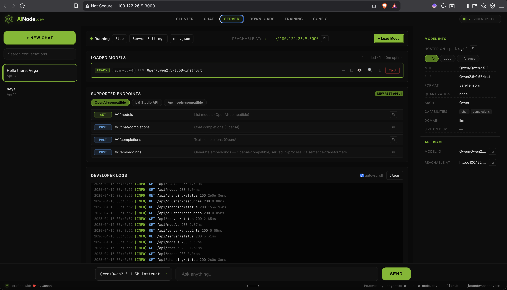
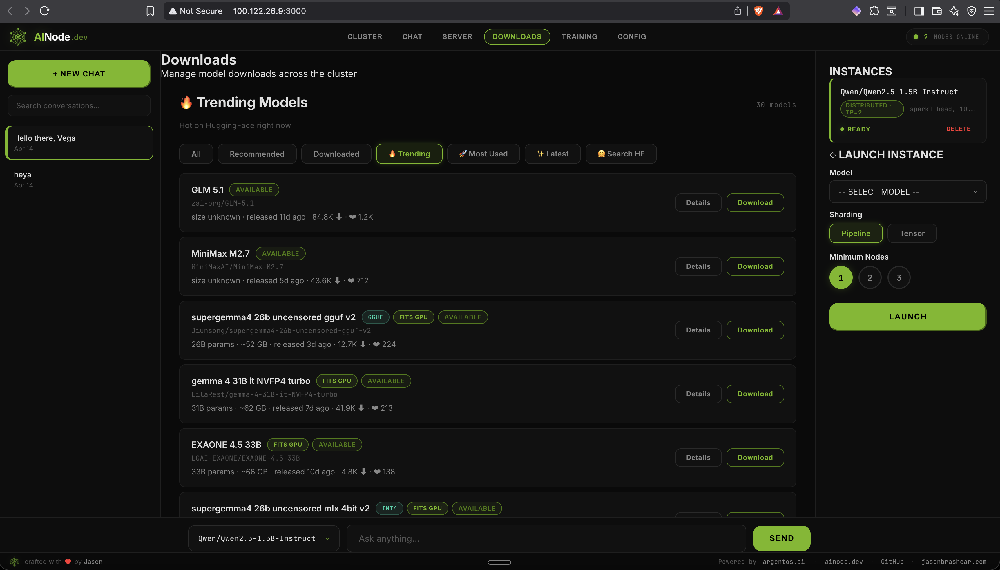
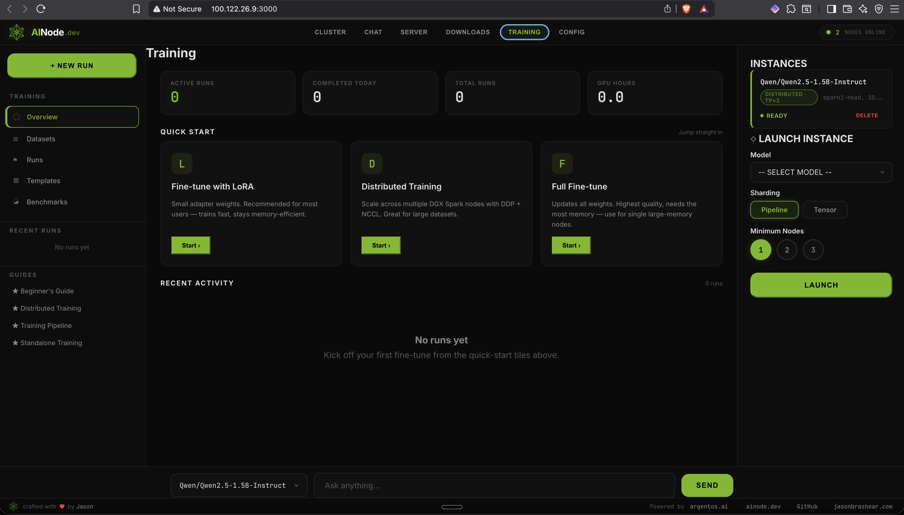
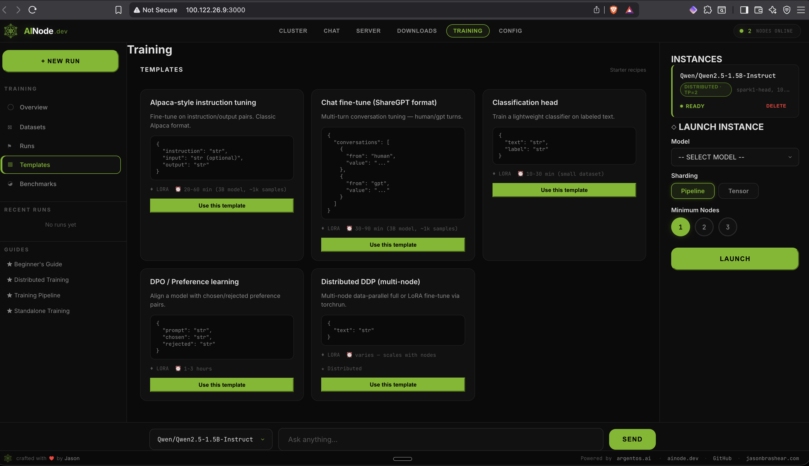
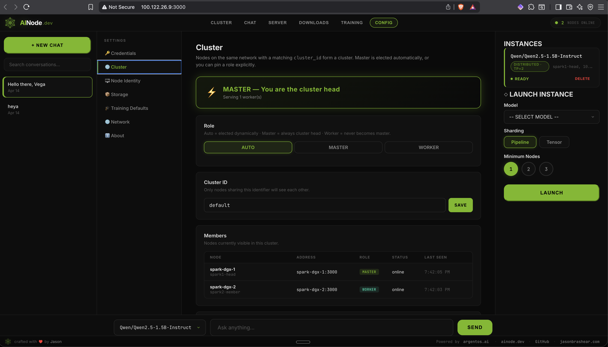

<!--
AINode — local AI platform for NVIDIA GB10 and any NVIDIA GPU server.
Keywords: NVIDIA DGX Spark, ASUS GX10, vLLM, Ray, tensor parallel,
OpenAI-compatible API, local LLM, self-hosted AI, LoRA fine-tuning,
cluster inference, GB10, CUDA 13, NCCL, RoCE, RDMA, container AI
platform, open source ChatGPT alternative.
-->

<p align="center">
  
</p>

<h1 align="center">AINode</h1>

<p align="center">
  <strong>Turn any NVIDIA GPU into a local AI platform.</strong><br/>
  <em>Inference + fine-tuning in your browser. One container to install. Add nodes, they find each other.</em>
</p>

<p align="center">
  <a href="https://github.com/getainode/ainode/releases/latest"></a>
  <a href="https://github.com/getainode/ainode/blob/main/LICENSE"></a>
  
  <a href="https://hub.docker.com/r/argentaios/ainode"></a>
  <a href="https://github.com/orgs/getainode/packages/container/package/ainode"></a>
  
  
  
  <a href="https://github.com/getainode/ainode/stargazers"></a>
  <a href="https://releasebot.io/updates/getainode/ainode"></a>
</p>

<p align="center">
  <a href="https://ainode.dev">ainode.dev</a>
  &nbsp;·&nbsp;
  <a href="https://docs.ainode.dev">docs</a>
  &nbsp;·&nbsp;
  <a href="#getting-started--step-by-step">Getting Started</a>
  &nbsp;·&nbsp;
  <a href="#screenshots">Screenshots</a>
  &nbsp;·&nbsp;
  <a href="#models-tested-on-ainode">Models tested</a>
  &nbsp;·&nbsp;
  <a href="#state-of-distributed-inference-june-2026">What Works / What Doesn't</a>
</p>

---

## What AINode is

AINode is a self-hosted AI appliance for **NVIDIA GB10** (DGX Spark, ASUS
GX10) and any NVIDIA GPU box. It ships as **one container** that bundles:

- A modern web UI (chat, cluster topology, server console, downloads, training)
- An OpenAI-compatible API (`/v1/chat/completions`, `/v1/completions`, `/v1/embeddings`)
  and the Anthropic Messages API (`/v1/messages`), both routed fleet-wide by model id
- A decision endpoint (`/v1/decide`): typed questions in, calibrated
  probabilities out, every question answered in one request
- A GB10-patched vLLM with Ray for cross-node tensor/pipeline parallel
- UDP node discovery for automatic clustering
- NFS-shared model storage so you download once and use everywhere
- Scripted fine-tuning (LoRA, QLoRA, full FT, DPO, distributed DDP)

One `docker pull`, one systemd unit per box, done. No host Python venv,
no source-built vLLM, no fragile runtime wiring.

```bash
curl -fsSL https://ainode.dev/install | bash
```

---

## Screenshots

### Cluster view — 4 nodes, 487 GB aggregated VRAM


The "MASTER" node (head) runs the API and orchestrates. The smaller
orbiting node (member) has its GPU reserved for a Ray worker that the
head placed. The instance card shows **DISTRIBUTED · TP=2** — the model
is sharded across both GPUs.

### Chat



Full-featured chat with streaming tokens, prompt history, code
highlighting, per-message metrics (TTFT, tokens/sec, total tokens).
Works against whatever model the cluster has loaded — solo or sharded.

### Server — API console (LM Studio style)



Live developer console: which models are loaded on which node,
OpenAI-/LM-Studio-/Anthropic-compatible endpoints, per-request logs
with status codes and latency, eject-model buttons, copyable cURL
snippets.

### Downloads — live HF catalog



Browse trending HuggingFace models, with **AVAILABLE** / **FITS GPU**
badges computed from your cluster's aggregate VRAM. Queue downloads to
the shared NFS cache; any node can load them instantly.

### Training — overview



Three quick-start paths: **LoRA** (lightweight, most users), **Distributed
DDP** (multi-node fine-tuning), **Full fine-tune** (single large-memory
node). Track active + completed runs, GPU-hours, and jump into dataset
management.

### Training — templates



Starter recipes for instruction tuning (Alpaca), chat fine-tuning
(ShareGPT), classification heads, DPO / preference learning, and
multi-node DDP. Each template ships a working dataset schema so you
can start training in minutes.

### Config — cluster



Pin the node's role (`auto` / `master` / `worker`), set a shared
`cluster_id` so only matching nodes see each other, and inspect the
current member list with per-node role, address, and last-seen.

---

## Getting Started — step by step

### Single node (solo mode)

1. **Install Docker** + NVIDIA container toolkit on your Linux box.
2. **Pull the image** and wire up the systemd unit:
   ```bash
   curl -fsSL https://ainode.dev/install | bash
   ```
   That one-liner:
   ```
   # resolves the highest numeric GHCR tag (never a floating :latest)
   docker pull ghcr.io/getainode/ainode:<latest-release>
   # pins it to ~/.ainode/image.env and installs a swappable systemd unit
   systemctl enable --now ainode.service
   ```
   The unit reads the pinned image from `~/.ainode/image.env`
   (`EnvironmentFile`, `Restart=always`), so it survives cold power
   cycles and **replays the models you had loaded** on boot.
3. **Open the UI** at `http://<your-ip>:3000`. First-run onboarding walks
   you through picking a model. Click a model card → click **Launch** →
   chat.

Upgrade is `ainode update` (resolves + pulls the newest pinned release
and restarts) — or `ainode update 0.5.2` to pin a specific version.

**Prefer to pull the image yourself?** Both registries serve identical
images — GHCR is canonical (what the installer uses), Docker Hub is a
public mirror:

```bash
docker pull ghcr.io/getainode/ainode:latest      # canonical (always newest)
docker pull argentaios/ainode:latest             # Docker Hub mirror
# pin a release instead: …/ainode:0.5.2
```

### Two nodes (distributed mode)

For models that don't fit on one GPU — e.g. a 70B-class model sharded
across two DGX Sparks:

1. **Wire a clean high-speed link** between the two nodes (direct QSFP
   cable on its own `/24`, or a dedicated switch port). See
   [Networking requirements](#networking-requirements) — this matters.
2. **Install AINode on both** (step 1 above).
3. **On the peer**, set member mode in `~/.ainode/config.json`:
   ```json
   {
     "distributed_mode": "member",
     "cluster_interface": "enp1s0f0np0",
     "ssh_user": "sem"
   }
   ```
   `sudo systemctl restart ainode`.
4. **On the head**, set head mode and add passwordless SSH to the peer:
   ```json
   {
     "distributed_mode": "head",
     "peer_ips": ["10.0.0.2"],
     "cluster_interface": "enp1s0f0np0",
     "ssh_user": "sem"
   }
   ```
   ```bash
   ssh-copy-id sem@10.0.0.2 && sudo systemctl restart ainode
   ```
5. **Open the head UI** — you should see both nodes, aggregated VRAM
   ("2 nodes · 244 GB · 2 GPUs"), and the instance badged as
   **DISTRIBUTED · TP=2**.

Want to do it from the browser instead? Open the Launch Instance
panel, pick the model, set **Minimum Nodes=2**, click **Tensor** →
**LAUNCH**. The UI writes the config and hot-swaps the engine for you.

---

## Quantize a model (AWQ / NVFP4)

AINode can compress a full-precision model to 4-bit **in the browser**, on your
own GPU — no external service. Open **Training → Quantize a Model**:

1. **Base model** — a Hugging Face repo id (`Qwen/Qwen3.5-4B`) or an installed model.
2. **Scheme** — **AWQ** (W4A16, proven on GB10 via `awq_marlin`) or **NVFP4**
   (Blackwell-native 4-bit float).
3. **Calibration samples** — default 256 (from `HuggingFaceH4/ultrachat_200k`).
4. *(optional)* **Push result to Hugging Face** — requires a **write** token;
   pushes a private repo under your namespace.

The target node must be **idle** — quantization needs the full unified memory, so
AINode refuses to start a quant job while a model is loaded (unload first, or pass
`force=true`). The output lands in **Installed** as `<org--name>-<scheme>`, ready
to serve.

> AWQ is the proven path on GB10. NVFP4 quantization is newer; **NVFP4 on
> multimodal models (e.g. Qwen3.5) is experimental and not yet verified** — prefer
> AWQ for the Qwen3.5 family today.

**Hugging Face tokens (read vs write).** AINode keeps credentials in a local
Secrets store (`~/.ainode/secrets.json`, mode 0600, obfuscated at rest) with two
HF slots: a **read** token (download gated models) and a **write** token (push to
the Hub — read-only tokens are rejected before any multi-GB transfer). Set them in
**Config → Secrets** (each has a **Test** button showing the detected scope), or
set the read token with `ainode config --hf-token hf_xxx`.

---

## Features

| Feature | Status |
|---|---|
| One-command install | ✅ |
| Unified container image (UI + engine) | ✅ v0.4.0 |
| Auto-detect GPU and memory | ✅ |
| Chat UI in your browser | ✅ |
| OpenAI-compatible API | ✅ |
| Embeddings endpoint (`/v1/embeddings`) | ✅ |
| Live HF model catalog with trending + download manager | ✅ |
| NFS-shared model storage across cluster | ✅ |
| Multi-node auto-discovery (UDP broadcast) | ✅ |
| Distributed tensor-parallel inference across nodes | ✅ (4-node verified — 487 GB aggregated VRAM) |
| Cluster topology UI (members, VRAM aggregate, instance badges) | ✅ |
| Browser-based fine-tuning (LoRA / QLoRA / Full + DDP) | ✅ |
| Training artifact retrieval + download via API | ✅ |
| LoRA adapter merge into base model | ✅ |
| Checkpoint resume | ✅ |
| Evaluation loop (configurable train/eval split) | ✅ |
| W&B logging integration | ✅ |
| Custom training template persistence | ✅ |
| Prometheus metrics endpoint (`/metrics`) | ✅ |
| `ainode role master\|worker\|solo` CLI | ✅ |
| Worker nodes start instantly — no model required | ✅ |
| Web portal available immediately on start | ✅ |
| Cluster-wide update from master UI (`⬆ Update all` button) | ✅ |
| Topology loading animation + per-node fade-in | ✅ |
| AWQ models on GB10 (sm_12.1) — `awq_marlin` kernel fix | ✅ |
| In-browser quantization (AWQ W4A16 / NVFP4) → serve or push to HF | ✅ v0.4.44 |
| Push quantized / fine-tuned models to Hugging Face (write-token) | ✅ |
| Secrets store (HF read + HF write + NGC + W&B + OpenAI), masked + testable | ✅ |
| Federated master router — route `/v1/*` by model name across the cluster | ✅ |
| Load / unload any model on any node from the master UI | ✅ |
| Model stacking — N concurrent models per node, persisted + replayed on boot | ✅ |
| Serve models from on-disk weights (`~/.ainode/models/<slug>`) | ✅ |
| fp8 KV-cache default on GB10 (long-context headroom) | ✅ |
| Per-load overrides (`served_model_name` / `max_model_len` / `kv_cache_dtype` / `quantization` / `trust_remote_code`), persisted across restarts | ✅ v0.5.0 |
| Node-targeted model load (`POST /api/cluster/load {node_id}`) | ✅ v0.5.1 |
| Stacked-load admission guard — explicit `gpu_memory_utilization` required, reject > 0.9 projected total (409) | ✅ v0.5.1 |
| VLM (vision) support — fp8 KV auto-skipped on GB10; `kv_cache_dtype=auto` per-load override | ✅ v0.5.1 |
| LoRA / QLoRA training **and** adapter merge run in a spawned GPU container (slim orchestrator has no torch) | ✅ v0.5.0 |
| Deploy pipeline — `git tag` → CI (self-hosted Spark runner) → GHCR → `ainode update` / cluster update-all (genuine pull + swap) | ✅ v0.5.0 |
| Cancellable, commit-pinned, parallel model downloads | ✅ v0.5.2 |
| Delete a downloaded model from disk (`delete-repo`, frees GB) | ✅ |
| AutoData — Δ-filtered synthetic-data generation (v2.2 val-set lift objective) | ✅ v0.5.0 |

---

## Relation to the Community

AINode builds on excellent open-source work in the DGX Spark ecosystem.
In particular, our base image inherits the patched NCCL from
**[eugr/spark-vllm-docker](https://github.com/eugr/spark-vllm-docker)**
(`dgxspark-3node-ring` branch), which we've found to be the most reliable
variant for handling GB10 unified-memory topologies and fabric setups.

eugr's project remains the go-to for raw, high-performance vLLM clustering
on Spark hardware. AINode layers a modern browser UI, one-command
deployment, in-browser chat + OpenAI API, and distributed fine-tuning on
top of that strong foundation.

Huge thanks to eugr and the contributors making multi-node Spark setups
practical.

---

## Models tested on AINode

Every row below is a model we launched through AINode on our own hardware and
then measured. One JSON record per run lives in [`bench/results/`](bench/results/),
and this table is generated from those files by
[`scripts/render-bench-table.py`](scripts/render-bench-table.py) so the prose
cannot drift from the data. If a model has no record there, we have not measured
it, and we would rather say so than publish a number we did not take.

<!-- BEGIN bench-table (generated by scripts/render-bench-table.py) -->

| Model | Params / active | Quant | Placement | Single-stream tok/s | 16 streams tok/s | Rubric | Date | Run |
|---|---|---|---|---|---|---|---|---|
| Qwen3.8-Flash-Next (NVFP4) | 125B / 6B active | NVFP4 (mixed, FP8 PLE) | Spark-2-DGX, 2× GB10, TP=2 | 26.2 | 207.6 | not run | 2026-09-16 | [AINode 0.5.18, TP=2 Spark-2+3, vLLM nightly, no MTP](https://github.com/getainode/ainode/blob/main/bench/results/20260916-204216-qwen3_8-flash-next-nvfp4-tp2-mp-nightly.json) |
| DeepSeek V4 Flash (DSpark, FP8) | 284B / 13B active | FP8 (FP4 experts) | Spark-2-DGX, 2× GB10, TP=2 | 34.5 | 94.0 | not run | 2026-09-16 | [AINode 0.5.11, TP=2 Spark-2+Spark-3, mp shape](https://github.com/getainode/ainode/blob/main/bench/results/20260916-033415-deepseek-v4-flash-dspark-fp8-tp2-mp.json) |
| Nemotron 3.5 Lightning 30B-A3B | 30B / 3B active | NVFP4 | Spark-4-GX10, 1× GB10, TP=1 (stacked) | 52.6 | not measured | not run | 2026-09-13 | [smoke](https://github.com/getainode/ainode/blob/main/bench/results/20260913-141115-nvidia-nemotron-3_5-lightning-30b-a3b-nvfp4-smoke.json) |
| Ornith 1.5 35B-A3B | 35B / 3B active | NVFP4 | Spark-1-DGX, 1× GB10, TP=1 (stacked) | 40.0 | 269.2 | 19/19 | 2026-09-13 | [text-only-mtp](https://github.com/getainode/ainode/blob/main/bench/results/20260913-130400-ornith-1_5-35b-a3b-nvfp4-text-only-mtp.json) |
| Qwen3.8 27B | 27B dense | NVFP4 | Spark-3-DGX, 1× GB10, TP=1 | 19.0 | 147.0 | 23/23 | 2026-08-15 | [mtp-vision](https://github.com/getainode/ainode/blob/main/bench/results/20260815-000000-qwen3_8-27b-nvfp4-mtp-vision.json) |
| Nemotron 3.5 Lightning 30B-A3B | 30B / 3B active | NVFP4 | Spark-4-GX10, 1× GB10, TP=1 | 104.5 | 504.3 | 19/19 | 2026-08-13 | [dspark-recipe](https://github.com/getainode/ainode/blob/main/bench/results/20260813-000000-nvidia-nemotron-3_5-lightning-30b-a3b-nvfp4-dspark-recipe.json) |
| Qwen3 235B-A22B | 235B / 22B active | NVFP4 | Spark-1..4, 4× GB10, TP=4 | 16.5 | not measured | not run | 2026-06-17 | [tp4-frontier-moe](https://github.com/getainode/ainode/blob/main/bench/results/20260617-000000-qwen3-235b-a22b-nvfp4-tp4-frontier-moe.json) |

<!-- END bench-table -->

## Coding harness runs

The same models, driven by their own coding agents. Each row is one model on one
harness (aider, dsh, ..., claude), generated from the same bench records as the
table above by
[`scripts/render-bench-table.py`](scripts/render-bench-table.py), so it cannot
drift from the data either. The latest run for a model-harness pair is the one
shown, and a harness a run flags "not measured" renders that phrase rather than a
number.

<!-- BEGIN harness-bench-table (generated by scripts/render-bench-table.py) -->

| Model | Harness | pass@1 | pass@2 | Mean s | Placement | Date | Run |
|---|---|---|---|---|---|---|---|
| DeepSeek V4 Flash | aider aider 0.86.2 | 9/10 | 10/10 | 47.3 | Spark-1-DGX, TP=2 | 2026-09-16 | [DeepSeek V4 Flash, TP=2 Spark-2+Spark-3, four harnesses, 10 Exercism tasks](https://github.com/getainode/ainode/blob/main/bench/results/20260916-112526-deepseek-v4-flash-dspark-four-harnesses-10-exercism-harness.json) |
| DeepSeek V4 Flash | dsh 0.1.5-rc.1 | 10/10 | 10/10 | 16.4 | Spark-1-DGX, TP=2 | 2026-09-16 | [DeepSeek V4 Flash, TP=2 Spark-2+Spark-3, four harnesses, 10 Exercism tasks](https://github.com/getainode/ainode/blob/main/bench/results/20260916-112526-deepseek-v4-flash-dspark-four-harnesses-10-exercism-harness.json) |
| DeepSeek V4 Flash | opencode 1.18.31 | 10/10 | 10/10 | 23.4 | Spark-2-DGX, TP=2 | 2026-09-17 | [DeepSeek V4 Flash TP=2, opencode after the PWD fix, 10 Exercism tasks](https://github.com/getainode/ainode/blob/main/bench/results/20260917-110113-deepseek-v4-flash-dspark-deepseek-v4-flash-tp-2-opencode-after-the-pwd-fix-10-exercism-tasks-harness.json) |
| DeepSeek V4 Flash | pi 0.73.1 | 9/10 | 10/10 | 13.8 | Spark-1-DGX, TP=2 | 2026-09-16 | [DeepSeek V4 Flash, TP=2 Spark-2+Spark-3, four harnesses, 10 Exercism tasks](https://github.com/getainode/ainode/blob/main/bench/results/20260916-112526-deepseek-v4-flash-dspark-four-harnesses-10-exercism-harness.json) |
| Nemotron 3.5 Lightning 30B-A3B | aider aider 0.86.2 | 8/10 | 10/10 | 389.5 | Spark-4-GX10, TP=1 | 2026-09-18 | [Spark-4 solo, thinking default](https://github.com/getainode/ainode/blob/main/bench/results/20260918-042104-nvidia-nemotron-3_5-lightning-30b-a3b-nvfp4-spark-4-solo-thinking-default-harness.json) |
| Nemotron 3.5 Lightning 30B-A3B | claude 2.1.274 (Claude Code) | 8/10 | 9/10 | 239.5 | Spark-4-GX10, TP=1 | 2026-09-18 | [Spark-4 solo, thinking default](https://github.com/getainode/ainode/blob/main/bench/results/20260918-042104-nvidia-nemotron-3_5-lightning-30b-a3b-nvfp4-spark-4-solo-thinking-default-harness.json) |
| Nemotron 3.5 Lightning 30B-A3B | dsh 0.1.5-rc.1 | 7/10 | 10/10 | 108.9 | Spark-4-GX10, TP=1 | 2026-09-18 | [Spark-4 solo, thinking default, dsh rerun after pytest preflight](https://github.com/getainode/ainode/blob/main/bench/results/20260918-053315-nvidia-nemotron-3_5-lightning-30b-a3b-nvfp4-spark-4-solo-thinking-default-dsh-rerun-after-pytest-preflight-harness.json) |
| Nemotron 3.5 Lightning 30B-A3B | pi 0.73.1 | 7/10 | 10/10 | 119.2 | Spark-4-GX10, TP=1 | 2026-09-18 | [Spark-4 solo, thinking default](https://github.com/getainode/ainode/blob/main/bench/results/20260918-042104-nvidia-nemotron-3_5-lightning-30b-a3b-nvfp4-spark-4-solo-thinking-default-harness.json) |
| Ornith 1.5 35B-A3B | aider | 9/10 | 10/10 | 116.3 | Spark-1-DGX, TP=1 | 2026-09-16 | [Ornith 1.5 35B-A3B on Spark-1, three harnesses, 10 Exercism tasks](https://github.com/getainode/ainode/blob/main/bench/results/20260916-165609-ornith-1_5-35b-a3b-nvfp4-ornith-1_5-35b-a3b-on-spark-1-three-harnesses-10-exercism-tasks-harness.json) |
| Ornith 1.5 35B-A3B | claude 2.1.272 (Claude Code) | 8/10 | 10/10 | 50.8 | Spark-1-DGX, TP=1 | 2026-09-16 | [Ornith 1.5 on Spark-1, Claude Code harness, 10 Exercism tasks](https://github.com/getainode/ainode/blob/main/bench/results/20260916-174134-ornith-1_5-35b-a3b-nvfp4-ornith-1_5-on-spark-1-claude-code-harness-10-exercism-tasks-harness.json) |
| Ornith 1.5 35B-A3B | dsh 0.1.5-rc.1 | 7/10 | 9/10 | 51.2 | Spark-1-DGX, TP=1 | 2026-09-17 | [Ornith 1.5 on Spark-1, thinking off by default, dsh, 10 Exercism tasks](https://github.com/getainode/ainode/blob/main/bench/results/20260917-022907-ornith-1_5-35b-a3b-nvfp4-ornith-1_5-on-spark-1-thinking-off-by-default-dsh-10-exercism-tasks-harness.json) |
| Ornith 1.5 35B-A3B | pi 0.73.1 | 5/10 | 10/10 | 43.2 | Spark-1-DGX, TP=1 | 2026-09-16 | [Ornith 1.5 35B-A3B on Spark-1, three harnesses, 10 Exercism tasks](https://github.com/getainode/ainode/blob/main/bench/results/20260916-165609-ornith-1_5-35b-a3b-nvfp4-ornith-1_5-35b-a3b-on-spark-1-three-harnesses-10-exercism-tasks-harness.json) |
| Qwen3.8 27B | aider aider 0.86.2 | 7/10 | 9/10 | 455.6 | Spark-1-DGX, TP=1 | 2026-09-16 | [Qwen3.8 27B NVFP4 on Spark-1, three harnesses, 10 Exercism tasks](https://github.com/getainode/ainode/blob/main/bench/results/20260916-144500-qwen3_8-27b-nvfp4-three-harnesses-10-exercism-harness.json) |
| Qwen3.8 27B | dsh 0.1.5-rc.1 | 10/10 | 10/10 | 269.9 | Spark-1-DGX, TP=1 | 2026-09-16 | [Qwen3.8 27B NVFP4 on Spark-1, three harnesses, 10 Exercism tasks](https://github.com/getainode/ainode/blob/main/bench/results/20260916-144500-qwen3_8-27b-nvfp4-three-harnesses-10-exercism-harness.json) |
| Qwen3.8 27B | pi 0.73.1 | 9/10 | 10/10 | 205.6 | Spark-1-DGX, TP=1 | 2026-09-16 | [Qwen3.8 27B NVFP4 on Spark-1, three harnesses, 10 Exercism tasks](https://github.com/getainode/ainode/blob/main/bench/results/20260916-144500-qwen3_8-27b-nvfp4-three-harnesses-10-exercism-harness.json) |
| Qwen3.8-Flash-Next | aider | 9/10 | 10/10 | 319.8 | Spark-1-DGX, TP=2 | 2026-09-16 | [Qwen3.8-Flash-Next TP=2 Spark-2+Spark-3, four harnesses, 10 Exercism tasks](https://github.com/getainode/ainode/blob/main/bench/results/20260916-201023-qwen3_8-flash-next-nvfp4-qwen3_8-flash-next-tp-2-spark-2-spark-3-four-harnesses-10-exercism-tasks-harness.json) |
| Qwen3.8-Flash-Next | claude 2.1.272 (Claude Code) | 8/10 | 10/10 | 46.1 | Spark-1-DGX, TP=2 | 2026-09-16 | [Flash-Next TP=2, Claude Code harness effort medium, 10 Exercism tasks](https://github.com/getainode/ainode/blob/main/bench/results/20260916-205159-qwen3_8-flash-next-nvfp4-flash-next-tp-2-claude-code-harness-effort-medium-10-exercism-tasks-harness.json) |
| Qwen3.8-Flash-Next | dsh 0.1.5-rc.1 | 10/10 | 10/10 | 96.2 | Spark-1-DGX, TP=2 | 2026-09-16 | [Qwen3.8-Flash-Next TP=2 Spark-2+Spark-3, four harnesses, 10 Exercism tasks](https://github.com/getainode/ainode/blob/main/bench/results/20260916-201023-qwen3_8-flash-next-nvfp4-qwen3_8-flash-next-tp-2-spark-2-spark-3-four-harnesses-10-exercism-tasks-harness.json) |
| Qwen3.8-Flash-Next | pi | 10/10 | 10/10 | 139.6 | Spark-1-DGX, TP=2 | 2026-09-16 | [Qwen3.8-Flash-Next TP=2 Spark-2+Spark-3, four harnesses, 10 Exercism tasks](https://github.com/getainode/ainode/blob/main/bench/results/20260916-201023-qwen3_8-flash-next-nvfp4-qwen3_8-flash-next-tp-2-spark-2-spark-3-four-harnesses-10-exercism-tasks-harness.json) |
| Spark-X2.5 4B | aider aider 0.86.2 | 3/10 | 6/10 | 923.4 | Spark-4-GX10, TP=1 | 2026-09-18 | [Spark-4 stacked beside Nemotron, first run](https://github.com/getainode/ainode/blob/main/bench/results/20260918-143104-spark-x2_5-4b-spark-4-stacked-beside-nemotron-first-run-harness.json) |
| Spark-X2.5 4B | claude 2.1.274 (Claude Code) | 4/10 | 7/10 | 636.7 | Spark-4-GX10, TP=1 | 2026-09-18 | [Spark-4 stacked beside Nemotron, first run](https://github.com/getainode/ainode/blob/main/bench/results/20260918-143104-spark-x2_5-4b-spark-4-stacked-beside-nemotron-first-run-harness.json) |
| Spark-X2.5 4B | dsh 0.1.5-rc.1 | 6/10 | 9/10 | 689.6 | Spark-4-GX10, TP=1 | 2026-09-18 | [Spark-4 stacked beside Nemotron, first run](https://github.com/getainode/ainode/blob/main/bench/results/20260918-143104-spark-x2_5-4b-spark-4-stacked-beside-nemotron-first-run-harness.json) |
| Spark-X2.5 4B | pi 0.73.1 | 3/10 | 7/10 | 574.8 | Spark-4-GX10, TP=1 | 2026-09-18 | [Spark-4 stacked beside Nemotron, first run](https://github.com/getainode/ainode/blob/main/bench/results/20260918-143104-spark-x2_5-4b-spark-4-stacked-beside-nemotron-first-run-harness.json) |

<!-- END harness-bench-table -->

### What is tested

- **Single-node MoE through the AINode launch path.** Nemotron 3.5 Lightning
  30B-A3B on a GX10 (104.5 tok/s single-stream, 504.3 tok/s across 16 streams,
  DSpark speculative decode accepting 55-61%) and Ornith 1.5 35B-A3B on a DGX
  Spark (40.0 tok/s, 269.2 tok/s across 16 streams) as a *second* stacked
  instance at `gpu_memory_utilization=0.26`.
- **Single-node dense.** Qwen3.8 27B NVFP4, 19.0 tok/s with Qwen3.5 MTP
  speculative decode against 11.8 tok/s without it. Dense decode on GB10 is
  bandwidth-bound, and the number shows it.
- **Model stacking.** Two engines on one node, both routed by model id through
  the AINode API. The Ornith run is the stacked instance, not a solo one.
- **Decode over context depth.** Ornith measured at 4K, 16K, 32K, 64K and 120K
  prompt tokens: 40.0 down to 34.4 tok/s decode, TTFT 194 ms up to 136 s.
- **Concurrency sweeps, not just peak.** 1/2/4/8/16 streams per run where it was
  measured, because the aggregate under load is the number an agent workload
  actually gets.
- **Four-node TP=4 on frontier MoE.** Qwen3-235B-A22B NVFP4 across 4× GB10 at
  16.5 tok/s single-stream, surviving a 3,513-token prefill. Measured June 2026
  on AINode 0.4.x with the `scitrera/dgx-spark-vllm` image.
- **Correctness, separately from speed.** Each rubric run is a fresh agent
  against the served endpoint: executed code, parallel tool calls, needle
  retrieval at three context depths, thinking on and off.

### What is not tested yet

- **Vision on Ornith 1.5.** It is launched text-only
  (`--limit-mm-per-prompt {"image":0,"video":0}`) because the multimodal warmup
  OOM-killed the engine on a node with roughly 35 GB free. No vision numbers and
  no vision rubric for that model.
- **TP=4 through the current launch path.** The 235B row predates 0.5.x. The
  four-node path has not been re-verified on 0.5.6, and that run has no
  concurrency sweep, no sustained number and no rubric.
- **The Dell C4130 (4× V100).** It joined the cluster as a worker on 2026-09-11,
  config only. No model has been launched on it through AINode: its raw vLLM
  container is still outside the launch path, and AINode's node announcement
  still reports 1 of its 4 GPUs.
- **GLM-5.3-Flash at TP=2.** It ran raw on the Spark-2/Spark-3 pair, outside
  AINode, and was stopped on 2026-09-14 when the pair moved to DeepSeek V4 Flash
  through AINode. No AINode-launched measurement exists for it.
- **DeepSeek V4.1 Flash.** Not launched through AINode: no vLLM build serves its
  architecture on GB10 yet. V4 Flash is in the table above, launched by AINode
  across two nodes with the mp shape; its 16-stream point has not been run.
- **Anything else.** Training throughput, embeddings and quantization jobs have
  no bench records yet.

### How these numbers were taken

All of it was measured on the hardware described in each row, through AINode's
own OpenAI-compatible endpoint. Generations are streamed and timed from the
first token, and the token counts are the server's `usage` block rather than our
own tokenizer estimate, so a bad chars-per-token guess cannot move a result.
Depth runs carry a unique nonce at the front of every prompt so that prefix
caching cannot serve a cached prefill and make long context look free. The
single-stream column is one request at a time; the 16-stream column is the
aggregate across 16 concurrent requests. The rubric is a separate pass with a
fresh agent driving the endpoint, and it only counts a task as passed when the
code it wrote actually executed or the needle came back verbatim. Sections
nobody measured are simply absent from the JSON and render here as "not
measured"; we do not backfill them with estimates. The record format is
documented in [`bench/SCHEMA.md`](bench/SCHEMA.md).

## Agentic rubric runs

The same models, scored on the mechanical parts an agent loop is made of: hold a
format, call one tool, call three at once, recover when a tool returns an error
instead of inventing the answer, keep a system rule alive over four turns, find one
sentence in a 100k-token prompt. Every verdict is mechanical, so no row here rests
on somebody's reading of a reply: group C runs the model's own code against asserts
it never saw, and group G judges the call trace of a real tool loop. Generated from
the same bench records by
[`scripts/render-bench-table.py`](scripts/render-bench-table.py); the flags and the
probe list are in [`bench/agentic/README.md`](bench/agentic/README.md). The latest
run for a model is the one shown, and the needle column is the largest prompt size
whose needle came back verbatim.

<!-- BEGIN agentic-bench-table (generated by scripts/render-bench-table.py) -->

| Model | Placement | Score | Tools (B+G) | Coding (C) | Reasoning (D) | Needle | Date | Run |
|---|---|---|---|---|---|---|---|---|
| DeepSeek V4 Flash | Spark-2-DGX, TP=2 | 22/25 | 9/9 | 3/3 | 2/4 | 100k | 2026-09-18 | [DeepSeek TP=2 Spark-2+3, full](https://github.com/getainode/ainode/blob/main/bench/results/20260918-013839-deepseek-v4-flash-dspark-deepseek-tp-2-spark-2-3-full-agentic.json) |
| Ornith 1.5 35B-A3B | Spark-1-DGX, TP=1 | 24/25 | 9/9 | 3/3 | 4/4 | 100k | 2026-09-18 | [Ornith stacked Spark-1, thinking on](https://github.com/getainode/ainode/blob/main/bench/results/20260918-013703-ornith-1_5-35b-a3b-nvfp4-ornith-stacked-spark-1-thinking-on-agentic.json) |
| Qwen3.8 27B | Spark-1-DGX, TP=1 | 24/25 | 9/9 | 2/3 | 4/4 | 100k | 2026-09-18 | [Qwen3.8 27B solo Spark-1, thinking on](https://github.com/getainode/ainode/blob/main/bench/results/20260918-020831-qwen3_8-27b-nvfp4-qwen3_8-27b-solo-spark-1-thinking-on-agentic.json) |
| Spark-X2.5 4B | Spark-4-GX10, TP=1 | 19/25 | 9/9 | 1/3 | 4/4 | 48k | 2026-09-18 | [Spark-4 stacked beside Nemotron, first run](https://github.com/getainode/ainode/blob/main/bench/results/20260918-151444-spark-x2_5-4b-spark-4-stacked-beside-nemotron-first-run-agentic.json) |

<!-- END agentic-bench-table -->

## Decision runs

A different question again: not how fast a model generates or whether it can drive
an agent, but whether a typed decision it makes can be trusted by code that acts on
the answer. Each row is one backend answering the same 110 labeled items in
[`bench/decide/items.json`](bench/decide/items.json) (route a request, triage a
ticket, is it urgent, is this diff safe to merge, is this statement true), scored on
accuracy and on something that matters more for automation: whether the confidence
it reports can gate anything.

Read the calibration columns before the accuracy one. A wrong answer at 0.95 gets
acted on and does damage; a wrong answer at 0.45 is an abstention a person looks at.
The Brier score is the probability put on the right answer, ECE is the gap between
claimed confidence and observed accuracy over five bins, and "Wrong at 0.9" is the
count that survives a 0.9 gate, over the answers that gate lets through. Generated
from the same bench records by
[`scripts/render-bench-table.py`](scripts/render-bench-table.py); the flags, the
sets and the protocol are in [`bench/decide/README.md`](bench/decide/README.md).

<!-- BEGIN decide-bench-table (generated by scripts/render-bench-table.py) -->

| Backend/Model | Placement | Items | Accuracy | Brier | ECE | Wrong at 0.9 | p50 ms | Cost | Date | Run |
|---|---|---|---|---|---|---|---|---|---|---|
| chat / Ornith 1.5 35B-A3B | Spark-1-DGX, TP=1 | 110 | 0.964 | 0.027 | 0.023 | 2 of 106 | 659 | $0 | 2026-09-18 | [Ornith stacked Spark-1, chat fallback](https://github.com/getainode/ainode/blob/main/bench/results/20260918-030249-ornith-1_5-35b-a3b-nvfp4-ornith-stacked-spark-1-chat-fallback-decide.json) |
| jev / jev-1.13.0 | typesafe.ai hosted | 110 | 0.964 | 0.024 | 0.049 | 0 of 80 | 306 | $0.0016 | 2026-09-18 | [jev-latest, 110 items](https://github.com/getainode/ainode/blob/main/bench/results/20260918-030240-jev-1_13_0-jev-latest-110-items-decide.json) |

<!-- END decide-bench-table -->

---

## State of Distributed Inference (June 2026)

We owe readers the honest picture, not a checkmark-soup. Here's what's
really running on our hardware.

### What works today (verified)

- **Single-node inference** on any NVIDIA GB10 box (DGX Spark, ASUS GX10).
- **Two-node tensor-parallel** (TP=2) with one GPU per node on a
  direct-connect QSFP `/24`. Both GPUs show ~61 GB of
  `ray::RayWorkerWrapper` memory; NCCL chose `NET/IB RoCE @ 200 Gb/s`.
- **Four-node cluster** (3× DGX Spark + 1× ASUS GX10) — 487 GB
  aggregated VRAM, all four discovered automatically via UDP, topology
  visible in the browser UI. Verified April 2026.
- **One-container-per-node install** — `curl -fsSL https://ainode.dev/install | bash -s -- --job worker`
  installs in seconds with no model required.
- **`ainode role`** CLI sets master/worker/solo instantly.
- **Worker nodes start immediately** — no model download, no engine
  warmup. Web portal is up within seconds of `systemctl start ainode`.
- **Shared model storage over NFS** from an NVMe-oF-backed master.
- **UDP cluster discovery** on port 5679 with real peer-IP capture.
- **Inference throughput:** ~35 tok/s for a warmed-up model over
  the RoCE fabric.

- **Four-node TP=4** — verified live on frontier MoE: `nvidia/Qwen3-235B-A22B-NVFP4`
  served at TP=4 across 4× GB10 (~16–17 t/s single-stream, survived a 3,513-token
  prefill). The GB10 sm120 fix was `--enforce-eager` (vLLM's FlashInfer prefill
  kernel emits an `illegal instruction` under CUDA-graph capture on GB10).
- **Federated serving** — a master routes `/v1/*` to the node holding each model;
  models load/unload per node from the browser.
- **Model stacking** — multiple models per node, persisted and replayed on boot.
- **In-browser quantization** — AWQ and NVFP4 jobs run on an idle node and land
  the result in Installed (optionally pushed to Hugging Face).

### What still needs care

- **Ray over Tailscale** — use physical cables or a dedicated switch.
- **Single NIC per cluster subnet** — multi-NIC ambiguity still breaks the NCCL ring.

### Lessons learned the hard way

0. **Role clarity eliminates half the problems.** The single biggest
   UX improvement was `ainode role master|worker|solo`. Workers don't
   need a model, don't need to think, don't need config editing. They
   start in 3 seconds and announce themselves. The master is the only
   node that needs a model. Everything else follows from that.

1. **Single NIC per cluster subnet.** Multi-NIC ambiguity breaks NCCL
   ring setup silently; `NCCL_SOCKET_IFNAME` only tells NCCL which
   address to *listen* on, not which source the kernel picks for
   outbound traffic.
2. **Ray placement groups outlive SIGKILL.** Hung vLLM doesn't release
   the reservation; Ray's GCS still thinks the GPU is busy. Always
   `docker rm -f` the full chain before retrying.
3. **Block-level shared storage is unsafe for multi-writer.** NVMe-oF +
   ext4 mounted on two hosts corrupts under concurrent writes. Put NFS
   on top of a single-host mount.
4. **The patched NCCL in `eugr/spark-vllm-docker`** (`dgxspark-3node-ring`
   branch) is the only variant we've seen reliably handle GB10
   unified-memory topologies. Our base image inherits it.
5. **SSH from a root container into a host user** fails silently when
   keys are mounted read-only from the host. Our entrypoint copies
   `/host-ssh` → `/root/.ssh` with correct perms and injects
   `User <ssh_user>` for peer IPs.

### Why 3 nodes is harder than 2 (and why 4 is probably easier)

**Two nodes**: a single direct-connect cable on one `/24`. One cable,
one subnet, one candidate interface per host. NCCL can't get confused.
TP=2 splits the weights evenly. Solved problem.

**Three nodes**: no simple physical topology. Options:

- **Triangle mesh** (A↔B, B↔C, A↔C) with each link on its own `/30` —
  community tooling assumes this, nobody autoconfigures it.
- **Dedicated cluster switch** with one NIC per node on an isolated
  subnet — easier, but a hardware purchase.
- **Star topology** — asymmetric latency, not recommended.

If your three nodes just share a regular LAN, you hit multi-NIC routing
ambiguity (lesson #1). We did. NCCL ring setup succeeded; data never
flowed.

**Four nodes**: paradoxically simpler once you commit to a switch,
which is the only practical option for 4+. One NIC per node on a fresh
`/24`, TP=4 lines up with vLLM's defaults, and the community has
published recipes (eugr's `recipes/4x-spark-cluster/`, NVIDIA's internal
4× Spark reference setups).

**Our hypothesis:** the difficulty is not *N* nodes — it's *how you
wire N nodes*. Two is forced (one cable). Three forces a topology
decision. Four+ forces a switch, which is what the community tools
expect. Stick to 2 now; buy the switch; jump straight to 4.

---

## Networking requirements

AINode relies on NCCL for cross-node tensor-parallel, and NCCL works
best when it owns a clean link.

- **Passwordless SSH** from the head's host user to every peer.
- **Single active NIC per cluster subnet** on every node. Multiple
  interfaces on the same `/24` breaks the NCCL ring.
- **No VPN between nodes for cluster traffic.** Tailscale is fine for
  laptop→cluster SSH; not fine as the NCCL transport.
- **Consistent MTU** across the cluster subnet.

### Recommended topologies

| Cluster size | Topology | Notes |
|---|---|---|
| 2 nodes | Direct QSFP cable, each end on its own IP in a fresh `/24` | Simplest, verified |
| 3 nodes | Triangle direct-connect (3 cables, each on a `/30`) **or** dedicated switch | Mesh is finicky; switch is easier |
| 4+ nodes | Dedicated QSFP switch on its own `/24`, one NIC per node | The only practical option |

### Diagnostic commands

```bash
# Confirm RDMA is live on your ConnectX-7
ibstat mlx5_0 | grep -E "State|Rate"         # expect "Active" + "Rate: 200"

# Confirm exactly one interface has an IP on the cluster subnet
ip -br -4 addr | grep 10.0.0                 # expect one line per node

# Confirm cross-node reach on the cluster subnet (not Tailscale)
ping -c 2 10.0.0.2
traceroute 10.0.0.2                          # 1 hop = right link

# Passwordless SSH works
ssh sem@10.0.0.2 true && echo OK

# After launching distributed: confirm NCCL uses RoCE, not Socket
docker exec vllm_node bash -c 'grep -E "Using network|NET/IB.*RoCE" \
  /tmp/ray/session_latest/logs/worker-*-01000000-*.out | head -5'
# Expect: "Using network IB" + "NET/IB ... mlx5_0:1/RoCE ... speed=200000"
```

### Optional: GPU Direct RDMA (GDR)

Without GDR, traffic goes GPU → CPU → NIC → NIC → CPU → GPU. With GDR
it bypasses the CPU hop. On GB10 the unified-memory CPU hop is cheap,
so the win is smaller than on discrete GPUs but still measurable.

```bash
# Load the peermem module on each host (not the container)
sudo modprobe nvidia_peermem
echo nvidia_peermem | sudo tee -a /etc/modules-load.d/nvidia-peermem.conf

# Verify NCCL picks it up next launch
docker exec vllm_node bash -c 'grep "GPU Direct RDMA" \
  /tmp/ray/session_latest/logs/worker-*-01000000-*.out'
# Expect: "GPU Direct RDMA Enabled"
```

---

## Shared model storage across a cluster

Downloading a 70 GB model three times on a three-node cluster is
wasteful. AINode supports a shared `models_dir` so every node pulls
from the same cache.

Block-level shared storage (NVMe-oF, iSCSI, Fibre Channel) is fast but
**unsafe for multiple Linux kernels writing simultaneously** — ext4
/ XFS have no distributed lock manager. Layer NFS on top:

```
  Storage array (NVMe-oF, SAN, local NVMe)
         │
         ▼
  MASTER NODE  ← ext4/XFS mounted here, owns the disk
    │   │
    │   └── NFS server exports /mnt/ai-models
    ▼
  WORKERS      ← mount the NFS share at /mnt/ai-shared
```

NFS over a 100G fabric gives 3–8 GB/s — vLLM model loading is a
one-shot sequential read, so you won't notice. For 100 GB+ models
where load time hurts, add an rsync-to-local staging step.

---

## CLI reference

The installer puts a thin `ainode` wrapper at `/usr/local/bin/ainode`.
Host-side commands (`update`) run directly; everything else is forwarded
into the running container via `docker exec`. You never need to type
`docker` yourself.

```bash
ainode update [version]      # resolve/pull newest (or pinned) tag + restart (upgrade in place)
ainode start                 # Start AINode (inference + web UI)
ainode stop                  # Stop AINode
ainode status                # Show cluster status
ainode models                # List available models
ainode service install       # Install the systemd unit
ainode service status        # Show systemd state + recent journal
ainode config                # Show current configuration
ainode logs -f               # Tail the engine log
```

### Updating AINode

Releases ship through a **tag-triggered pipeline**: `git tag vX.Y.Z` →
CI on a self-hosted Spark runner builds and pushes
`ghcr.io/getainode/ainode:X.Y.Z`. To upgrade a node in place:

```bash
ainode update
```

That resolves the **highest numeric GHCR tag** (never a floating
`:latest`), pulls it, pins it to `~/.ainode/image.env`, and restarts the
systemd service. Your config (`~/.ainode/config.json`), models
(`~/.ainode/models/`), and fine-tune outputs are on the host — the
container is stateless, so upgrades never touch your data.

To pin a specific version:

```bash
ainode update 0.5.2
```

To roll every node in a cluster from the master, use the **Update all**
button or:

```bash
curl -X POST http://<master>:8000/api/cluster/update-all   # genuine pull + swap on every node
```

---

## API

AINode exposes an OpenAI-compatible API. Drop it into any tool that
speaks OpenAI:

```python
from openai import OpenAI

client = OpenAI(
    base_url="http://localhost:8000/v1",
    api_key="not-needed",
)

resp = client.chat.completions.create(
    model="Qwen/Qwen2.5-1.5B-Instruct",
    messages=[{"role": "user", "content": "Hello!"}],
)
print(resp.choices[0].message.content)
```

Works with Open WebUI, LiteLLM, LangChain, llama.cpp clients, and
anything else that speaks OpenAI.

### Decisions: `POST /v1/decide`

A decision endpoint rather than a chat one. You hand over a state, an optional
block of domain guidance and a dict of independent multiple-choice questions.
Every question is asked at once against whatever model the node or fleet has
loaded, and each answer comes back with the probability the model put on it plus
the full distribution over that question's options.

Each question becomes one chat completion whose output is grammar-constrained
(vLLM's `structured_outputs: {"choice": [...]}`) to a single lettered label, with
`logprobs` on and thinking off. The probability is a softmax over the first
generated token's logprobs restricted to those labels, renormalized. The shared
state goes in front of the question so every call in a request has the same
prompt prefix and the engine's prefix cache prefills it once.

Request:

```json
{
  "model": "ornith-ai/Ornith-1.5-35B-A3B-NVFP4",
  "state": "any string, or any JSON object (serialized compactly for you)",
  "instructions": "optional domain guidance, appended to the system prompt",
  "questions": {
    "category":    {"question": "Which queue?", "options": ["billing", "bug", "spam"]},
    "needs_human": {"question": "Does this need a human?", "type": "boolean"},
    "urgency":     {"question": "How urgent?", "type": "score", "min": 1, "max": 5}
  }
}
```

`type: "boolean"` is sugar for `["yes", "no"]` and `type: "score"` for
`["1", ... "5"]` (or whatever `min`/`max` you give). A question takes 2 to 255
options, all distinct strings. `model` is optional and defaults to the node's
loaded model, or to the fleet's only model if this node has none.

Response:

```json
{
  "model": "ornith-ai/Ornith-1.5-35B-A3B-NVFP4",
  "node": "Spark-Ornith",
  "latency_ms": 541.3,
  "decisions": {
    "category": {
      "answer": "bug",
      "confidence": 0.999331,
      "distribution": {"billing": 8.7e-05, "bug": 0.999331, "spam": 0.00014},
      "latency_ms": 540.7
    }
  },
  "usage": {"prompt_tokens": 567, "completion_tokens": 6, "calls": 3}
}
```

Probabilities are keyed by your option strings, not by the letters used to
constrain the engine. A `200` always carries every question: a bad shape is a
`400` naming what is wrong, and an engine that cannot answer is a `503`. If the
engine returns no logprobs, `distribution` is `null`, `confidence` is `1.0` and
the entry carries `"note": "no logprobs from engine"`.

```bash
curl -s http://localhost:3000/v1/decide -H 'Content-Type: application/json' -d '{
  "state": {"subject": "Invoice PDF download returns 500 since Tuesday", "plan": "pro"},
  "instructions": "B2B SaaS support queue. Revenue-blocking regressions outrank cosmetic bugs.",
  "questions": {
    "category":    {"question": "Which queue should this go to?",
                    "options": ["billing", "bug", "feature request", "account access", "spam"]},
    "urgency":     {"question": "How urgent is this, 1 lowest and 5 highest?",
                    "type": "score", "min": 1, "max": 5},
    "needs_human": {"question": "Does this need a human to reply?", "type": "boolean"}
  }
}'
```

Caveat past 26 options: labels continue `AA`, `AB`, and so on. When the
tokenizer does not give a two-letter label its own token, that label's mass is
its first letter's token mass, which the single-letter label of the same letter
also claims. Read such a pair as jointly calibrated.

### Metrics — `/metrics` (Prometheus) and `/api/metrics` (JSON)

AINode exposes its own metrics on the same port as the API:

```bash
curl http://localhost:8000/metrics           # Prometheus text exposition
curl http://localhost:8000/api/metrics       # JSON snapshot
curl http://localhost:8000/api/metrics/gpu   # GPU subset
```

Key series:

- `ainode_uptime_seconds`, `ainode_build_info{version=...}`
- `ainode_requests_total`, `ainode_request_errors_total`
- `ainode_tokens_generated_total`, `ainode_tokens_per_second`
- `ainode_request_latency_milliseconds{quantile="0.5|0.95|0.99"}`
- `ainode_requests_by_model_total{model=...}`
- `ainode_gpu_utilization_percent`, `ainode_gpu_memory_used_bytes`, `ainode_gpu_temperature_celsius`

Scrape config for Prometheus:

```yaml
scrape_configs:
  - job_name: ainode
    static_configs:
      - targets: ["ainode-host:8000"]
```

---

## Requirements

- **OS**: Ubuntu 22.04+ (DGX Spark OS works out of the box)
- **GPU**: NVIDIA GB10 (DGX Spark, ASUS GX10) — or any NVIDIA GPU with
  CUDA 13 drivers
- **Memory**: 8 GB+ GPU for small models, 128 GB recommended for the
  big ones, 240 GB+ aggregated for real sharded work
- **Disk**: 20 GB for the container image; more for models
- **Docker**: 24.0+ with the NVIDIA Container Toolkit

---

## Why AINode?

| | Cloud AI | AINode |
|---|---|---|
| Monthly cost | $100–10,000+ | $0 (you own the hardware) |
| Data privacy | Your data on their servers | Your data stays local |
| Rate limits | Yes | None |
| Latency | 200–2000 ms | 10–50 ms |
| Fine-tuning | Limited, expensive | Unlimited, free |
| Internet required | Yes | No |
| Models available | Their choice | Your choice |

---

## Roadmap

- [x] Core CLI + installer
- [x] vLLM integration (patched NCCL for GB10)
- [x] Web UI (chat, server, downloads, training, config)
- [x] Multi-node auto-discovery + cluster topology view
- [x] Automatic model sharding across nodes (TP=2 verified)
- [x] NFS-shared model storage
- [x] Unified container image + systemd install
- [x] Browser-driven fine-tuning (LoRA / QLoRA / Full + DDP)
- [x] Training artifact retrieval, LoRA merge, checkpoint resume
- [x] Evaluation loop + W&B integration
- [x] Prometheus metrics endpoint (`/metrics`)
- [x] 4-node TP=4 sharded inference (verified — 235B-A22B-NVFP4)
- [x] In-browser quantization (AWQ / NVFP4) + push to Hugging Face
- [x] Federated multi-model serving (master routes `/v1/*` by model name)
- [x] Model stacking (N models per node, persisted + replayed)
- [x] Training + adapter-merge in a spawned GPU container (slim orchestrator)
- [x] Deploy pipeline (tag → CI → GHCR → `ainode update` / cluster update-all)
- [x] VLM (vision) serving with fp8-KV auto-skip on GB10
- [x] AutoData — Δ-filtered synthetic-data generation (val-set lift objective)
- [ ] Model marketplace (custom registries)
- [ ] Mobile-friendly UI

---

## Contributing

AINode is Apache-2.0 and welcomes contributions. See
[CONTRIBUTING.md](CONTRIBUTING.md) — and please run the test suite
(`pytest tests/`) before opening a PR.

---

## License

Apache 2.0 — use it however you want.

---

<p align="center">
  <sub>crafted with <span style="color:#e74c3c">♥</span> by Jason Brashear · powered by <a href="https://argentos.ai">argentos.ai</a></sub>
</p>
